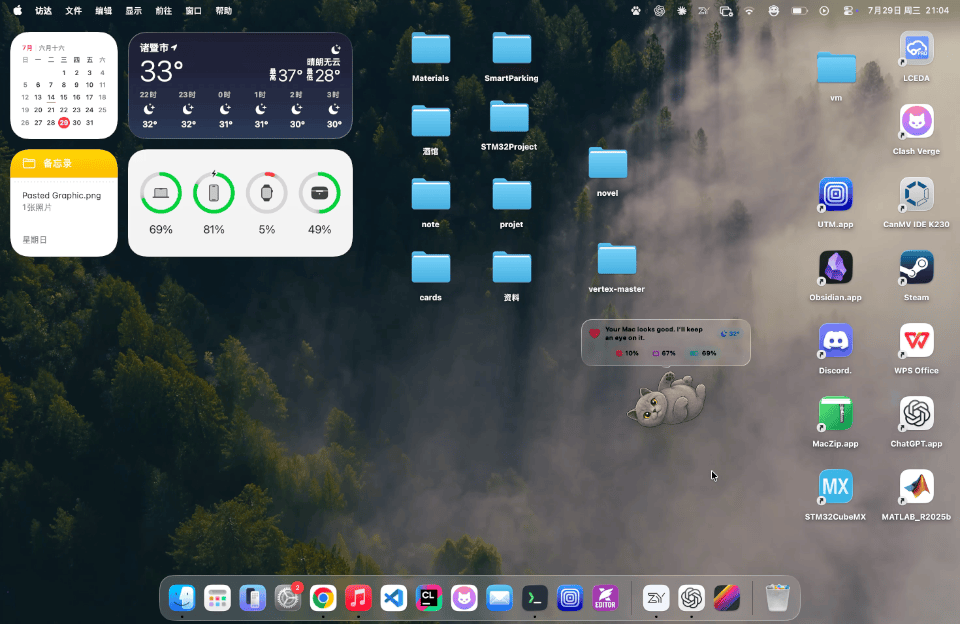
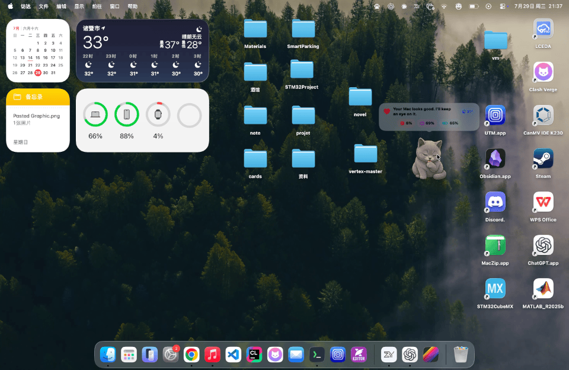

<p align="center">
  
</p>

<h1 align="center">YuanGUI and VCC</h1>

<p align="center">
  A native macOS companion that keeps you company, plays music, watches the weather and your Mac, and chats with you.
</p>

<p align="center">
  
  
  
  <a href="https://github.com/YangChen-cn/yuangui/actions/workflows/tests.yml"></a>
</p>

[简体中文](README.zh-CN.md) · [Latest release](https://github.com/YangChen-cn/yuangui/releases/latest) · [Installation and permissions](docs/INSTALLATION.md)

## Overview

YuanGUI is a native macOS companion and productivity tool built with SwiftUI, AppKit, and Swift Package Manager. It brings character companionship, music, system status, weather, AI chat, screenshots, OCR translation, journaling, and careful maintenance into a lightweight floating panel and menu bar app.

Choose YuanGUI, VCC, or both. The companions react to battery, memory, weather, and time, and can speak short lines, tuck against an edge, show a mini status view, or open the full status panel.

The current stable release is `2.8.2`. This maintenance release makes Finder document names immediately editable, removes repeated FinderSync application discovery after a restart, expands playlist play targets, preserves selected LRCLIB lyrics for Bilibili, makes the menu-bar cover open the complete player, and keeps recently shown covers warm without retaining a hidden panel. See the [2.8.2 release notes](RELEASE_NOTES.md#282--stable-maintenance-release) for details.

## Interface preview

<p align="center">
  
</p>

<table>
  <tr><th>Companion and status bar</th><th>Journal</th></tr>
  <tr>
    <td></td>
    <td></td>
  </tr>
  <tr><th>Music player</th><th>AI chat</th></tr>
  <tr>
    <td></td>
    <td></td>
  </tr>
</table>

## Features

- **Three companion modes**: YuanGUI, VCC, or both together, with lightweight animated reactions.
- **Smart state reactions**: low battery, charging, memory pressure, rain, and bedtime states.
- **Status panel**: CPU, memory, disk, network, battery, uptime, music, and common tools.
- **Local weather**: approximate location through macOS permission and Open-Meteo, with no weather API key.
- **Journal**: local photos, Markdown, calendar, mood, weather, music, search, favorites, recently deleted items, and Markdown/JSON/ZIP export.
- **AI chat**: OpenAI-compatible endpoints, streaming replies, attachments, local history, and editable prompts.
- **Music player**: Apple Music, Bilibili, and local audio. Local Music supports MP3, M4A, AAC, WAV, and AIFF, with search, stable sorting, playlists, favorites, custom cover art, matching LRC lyrics, lyric cache, and desktop lyrics.
- **Efficient music updates**: playback progress, transport controls, lyrics, library, account, Bilibili import, and local import use separate observable state, keeping frequent updates inside the smallest relevant view.
- **Bilibili library**: QR login, authorized subtitles, and deduplicated favorites import without storing passwords.
- **Screenshots and translation**: region capture, annotations, on-device Vision OCR, screenshot translation, selected-text translation, and Apple or online translation engines.
- **Cleanup House**: conservative cleanup, uninstall tools, allowlists, operation logs, and path safety checks.
- **Desktop interaction**: drag, edge docking, mini status, resizing, interaction lock, mouse pass-through, and Finder icon visibility controls.
- **Finder context menu**: create TXT, Markdown, Word, Excel, and PowerPoint documents; copy paths; open Terminal; and move files with right-click Cut/Paste on local Finder locations.
- **Pet-led onboarding and feature discovery**: a first-launch walkthrough where the companions introduce themselves and the app's tools through guide bubbles with real actions, a right-click tools menu on the pet, one-time feature tips that skip features you already used, and a re-watch entry in the pet menu and Settings.

## Requirements and installation

- macOS 15 Sequoia or later
- Swift 6 / current Xcode for source builds
- Your own OpenAI-compatible API URL and key for AI chat
- Network access for weather, Bilibili playback, lyric matching, and update checks

Download the DMG from the [latest release](https://github.com/YangChen-cn/yuangui/releases/latest), then drag `YuanGUI.app` to Applications. Builds use the local `YuanGui` self-signed identity. If macOS blocks the first launch, Control-click the app and choose **Open**, or allow it in **System Settings → Privacy & Security**.

See the complete [installation and permission guide](docs/INSTALLATION.md). Location, Screen Recording, Accessibility, Music/Finder Automation, and file access are requested only when the related feature is used.
After installing the app, enable **YuanGUI Finder Extension** once in **System Settings → General → Login Items & Extensions**. iCloud Drive and third-party File Provider locations are not guaranteed in the first version.

## Build from source

```bash
git clone https://github.com/YangChen-cn/yuangui.git
cd yuangui
swift test
./script/build_and_run.sh --verify
VERSION=2.8.2 BUILD=21 ./script/package_dmg.sh
```

The run script builds and launches a verified app bundle. The package script creates and checks a DMG and prints its SHA-256. Both default to the registered `YuanGui` self-signed identity; Developer ID and notarization remain optional overrides.

## Music

Open the full player from the status bar music panel or Settings, then select Apple Music, Bilibili, or Local Music.

- Apple Music controls the system Music app.
- Bilibili accepts video URLs, BV IDs, and `b23.tv` links. QR login enables authorized subtitles and favorites import.
- Local Music reads audio only after you choose files or folders in the system import panel. It uses security-scoped bookmarks for continued access and never changes the original files.
- Local tracks can use embedded artwork or a cover image you choose. Relocating a missing file refreshes its metadata, duration, artwork, and matching sidecar lyrics while preserving favorites and playlist references.
- A matching `.lrc` beside an imported track takes priority over the lyrics cache and LRCLIB lookup. Playlists, favorites, lyrics, offsets, and progress stay on this Mac.

The menu bar panel follows the selected source and shows source-specific empty-state actions. The full player supports library search and stable display-only sorting, detailed import failures, and revealing local files in Finder. Built-in library labels are localized while user playlist and track names remain unchanged.

## Screenshots and translation

Configure global shortcuts in **Settings → Quick Tools**. Screenshots and OCR run locally through Vision. Translations can open in an editable window or be placed over the original screenshot with adaptive layout. Replacing selected text is enabled only when the original app and editable selection can still be verified.

## Privacy and safety

- API keys, chat history, journal entries, music data, Bilibili cookies, and refresh tokens stay in local app data.
- Attachments are sent only to the AI service you explicitly configure; original files are not copied into chat history.
- YuanGUI does not scan Desktop, Downloads, Documents, Music, the home directory, or other locations on launch.
- Cleanup never uses `sudo`, changes system settings, resets services, rebuilds Spotlight, or analyzes the whole disk.
- Review-only items are not selected by default. Project artifacts and installers go to the Trash, never permanent deletion.
- Protected paths, symbolic links, running apps, cloud drives, password managers, AI-model data, and YuanGUI data are skipped.
- Every cleanup operation is previewed, confirmed, checked again before execution, and logged locally.

## Localization

YuanGUI supports English and Simplified Chinese. Open **Settings → General → Language**, choose System, English, or Simplified Chinese, then reopen the app. Existing journal entries, playlists, track names, and other user content are not translated or renamed.

## Tests and packaging

```bash
swift test
VERSION=2.8.2 BUILD=21 ./script/package_dmg.sh
```

Tests cover system metrics, companion states, weather, AI services, music sources and local import, lyrics, translation layout, cleanup safety, settings persistence, and resource loading. The music suite also verifies publisher isolation and cancellation-safe shutdown with suspended services. GitHub Actions runs `swift test` for pushes and pull requests. A repeatable SwiftUI Instruments comparison is documented in [Music observation performance](docs/MUSIC_PERFORMANCE.md).

## License

Source code is licensed under [GPL-3.0-only](LICENSE), copyright © YangChen-cn. Original icons, sprites, character art, and `docs/media` use [CC BY-SA 4.0](ASSET_LICENSE.md). Reused code and acknowledgements are listed in [THIRD_PARTY_NOTICES.md](THIRD_PARTY_NOTICES.md).
