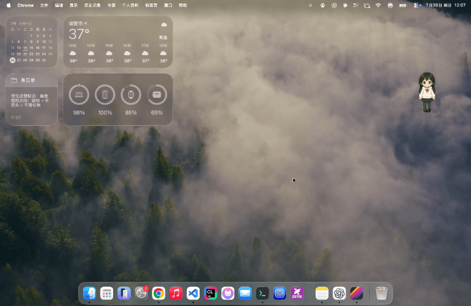
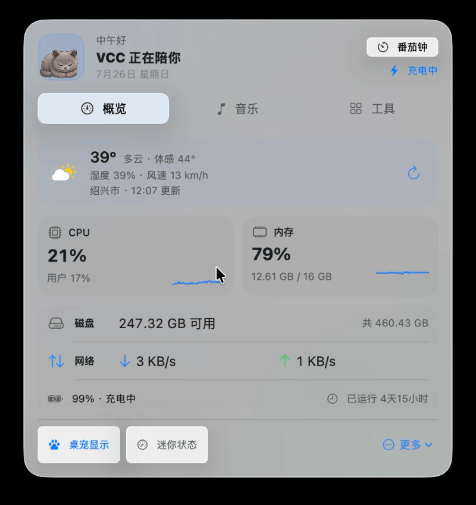
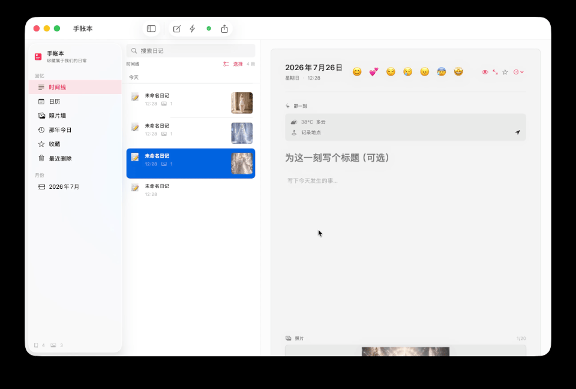
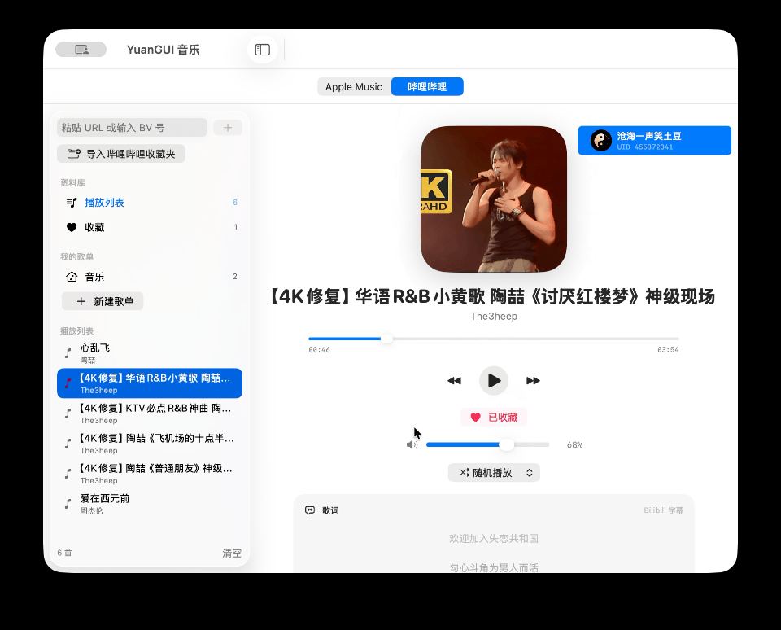

<p align="center">
  
</p>

<h1 align="center">元圭与 VCC</h1>

<p align="center">
  一只会陪伴、听歌、看天气、关注 Mac 状态，也能和你聊天的原生 macOS 桌宠。
</p>

<p align="center">
  
  
  
  <a href="https://github.com/YangChen-cn/yuangui/actions/workflows/tests.yml"></a>
  <a href="https://github.com/YangChen-cn/yuangui/releases/latest/download/YuanGUI-2.7.0.dmg"></a>
</p>

## 项目简介

“元圭与 VCC”是一款使用 SwiftUI、AppKit 和 Swift Package Manager 开发的原生 macOS 桌宠与效率工具。它把角色陪伴、音乐播放、系统状态、天气、AI 对话、截图标注、OCR 翻译和基础维护工具整合在轻量的透明悬浮面板与菜单栏入口中。

应用提供元圭、蓝猫 VCC 和两人一起三种角色模式。桌宠会根据电池、内存、天气与时间自动改变动作，也可以播放日常对白、贴边收纳、显示迷你状态，或在需要时打开完整状态面板。

当前稳定版本为 `2.7.0`，`2.7.1` 正在准备中。这次更新主要处理音乐播放器的性能和异步生命周期：播放进度、歌词、资料库、账号和导入状态各自只刷新需要它们的界面，关闭应用或取消操作后，过期任务也不会再写回状态。详情见 [2.7.1 更新说明](RELEASE_NOTES.zh-CN.md#271--音乐性能与异步生命周期优化)。

## 界面预览

### 综合演示

<p align="center">
  
</p>

### 分项演示

<table>
  <tr>
    <th>桌宠与状态栏</th>
    <th>元圭恋爱手帐</th>
  </tr>
  <tr>
    <td></td>
    <td></td>
  </tr>
  <tr>
    <th>音乐播放器</th>
    <th>桌宠AI聊天</th>
  </tr>
  <tr>
    <td ></td>
    <td ></td>
  </tr>
</table>

## 主要功能

- **三种角色模式**：元圭、VCC、元圭与 VCC 一起。
- **全新的本地音乐能力**：可通过系统面板导入 MP3、M4A、AAC、WAV 和 AIFF 文件或文件夹，支持安全作用域书签、元数据和内嵌封面读取、本地歌单、收藏、搜索、稳定排序、播放进度恢复、Finder 定位及文件丢失后的重新定位。
- **本地封面与资料维护**：可以为本地歌曲导入或移除自定义封面；重新定位歌曲会刷新标题、歌手、专辑、时长、封面和同名 LRC，同时保留歌曲 ID、收藏和歌单引用。删除歌曲、重复导入及资料库恢复时会安全清理无主封面缓存。
- **清理屋安全与交互重做**：扫描和执行依赖延迟到用户主动操作后创建，启动时不会触碰桌面等受保护目录；新增项目扫描位置、分类摘要、硬链接去重、执行前身份复核、共享数据保护、运行中应用提示和更清晰的选择交互。项目构建产物与旧安装包只会移入废纸篓。
- **播放器与歌词改进**：本地音乐和哔哩哔哩资料库支持纯逻辑搜索与排序；本地歌词优先读取同目录同名 LRC，并与歌词缓存、LRCLIB、歌词偏移、点击跳转、桌面歌词及桌宠听歌动作共用一致的播放状态。
- **元圭恋爱手账**：原生 macOS 三栏日记界面，支持快速记录、心情、天气、地点、播放中的音乐、标签、Markdown、照片、日历、照片墙、那年今日、搜索、收藏、最近删除以及 Markdown/JSON/ZIP 导出。
- **本地日记存储**：日记和附件保存在本机，采用带格式版本的 JSON、原图/缩略图分离、损坏文件隔离、竞态安全的自动保存和可验证备份恢复；每天最多自动备份一次，并保留 7 个每日备份和 4 个每周备份。
- **轻量动作效果**：每个普通动作和状态动作都带有短暂的位移、缩放、摆动或弹跳效果；低电量模式和“减少动态效果”下会自动静止。
- **智能状态反应**：支持低电量、充电、内存压力、下雨和睡觉时间等状态动作；电量 20% 时短暂气泡提醒，10% 及以下才进入紧急提醒，内存达到 90% 或系统报告严重压力时提醒。
- **系统状态面板**：查看 CPU、内存、磁盘、网络、电池和运行时间。
- **本地天气**：经用户授权后获取大致位置，并通过 Open-Meteo 获取天气，无需天气 API Key。
- **主动对白**：可设置 1–120 分钟的日常对白间隔，并在天气刷新后进行角色化播报。
- **AI 对话**：支持 OpenAI 兼容接口、SSE 流式回复（单次最多 4096 tokens）；填写 URL 与 API Key 后可自动读取模型，也可以手动填写模型名和编辑角色提示词。
- **附件对话与历史记录**：支持图片和文本类附件，保留本地聊天历史；异步回复始终写回发起请求的会话。
- **统一音乐播放器**：可以控制系统 Apple Music，也能导入哔哩哔哩 URL、BV 号和短链接播放公开视频音频；状态栏和完整播放器均可独立调节音量，并可选择在其他应用持续播放声音时自动暂停。
- **更精细的音乐界面刷新**：播放进度、控制按钮、歌词、资料库、哔哩哔哩账号与导入、本地导入分别观察自己的状态，高频进度或导入更新不再带动无关界面重算。
- **哔哩哔哩资料库**：支持读取登录账号创建或收藏的视频收藏夹，弹窗选择后一键去重导入；同时支持播放列表、收藏、本地歌单和多种播放模式。
- **哔哩哔哩扫码登录与字幕**：登录后可读取账号有权访问的播放器字幕；应用不会读取或保存账号密码。
- **歌词与听歌陪伴**：支持 LRCLIB 自动匹配、单独修改歌曲名或歌手、导入 LRC、手动输入与精细调整歌词偏移，以及带可调透明度细条、Liquid Glass 控制按钮和圆体、苹方、宋体、楷体等字体的桌面悬浮歌词；播放期间角色会切换到听歌动作。
- **应用内更新**：设置中显示当前版本和更新内容，可读取 GitHub Release 更新日志并一键下载安装新版本。
- **清理屋**：提供保守的空间清理、软件卸载、白名单、操作记录和路径安全检查。
- **废纸篓互动**：把文件拖到桌宠上即可移入废纸篓，也可以打开或确认清空废纸篓。
- **桌面交互**：支持拖动和左右贴边收纳；靠近边缘时显示磁吸预览，松手后切换为透明角色探头，悬停稍微探出并可显示鼠标穿透的窄版 CPU、内存与电量监控，低电量或内存压力时会主动提醒，点击后平滑恢复到屏幕范围内。另支持尺寸调节、交互锁定与鼠标穿透；锁定后悬停只显示一个紧凑解锁按钮，也可一键隐藏或显示 Finder 桌面图标。
- **菜单栏入口与登录启动**：桌宠隐藏后仍可通过菜单栏恢复；状态栏“工具”页集中提供 AI 对话、清理屋、软件卸载、截图、翻译、废纸篓和设置入口，并可选择登录时自动启动。
- **区域截图与标注**：按 `Control-A` 选区截图，添加画笔、文字、箭头、形状、高亮和马赛克，并复制或保存 PNG。
- **截图翻译（OCR）**：按 `Control-Shift-A` 选区截图，通过 Vision 在本机完成结构化 OCR，再按语义句子批量翻译。可以使用紧凑翻译窗口，也可以把译文按原文位置覆盖到截图上；覆盖层支持独立原文遮盖补片、完整文本逻辑画布、以指针为锚点的触控板捏合、窗口与译图同步缩放、安全扩展窄文本宽度、同步中英对照、复制、拖动和 `Esc` 关闭。
- **划词与手动翻译**：按 `Control-Z` 翻译网页或应用选区；没有选中文字时仍会打开窗口，可直接输入原文。翻译窗口保持单实例，新窗口会自动关闭上一个；支持修正原文后重新翻译、复制译文，并在可编辑输入框中校验后替换原选区。
- **可选翻译引擎**：默认通过系统快捷指令免费调用 Apple 翻译，也可手动选择 Apple 本地翻译或在线 AI。在线 AI 只有在用户明确选择并完成配置后才会调用。

系统快捷指令调用参考 [QuickTranslate](https://github.com/ringozzt/quicktranslate)（MIT）：通过 `shortcuts run` 的标准输入传入 JSON，源语言留空自动检测，并使用系统要求的 `zh_CN`、`en_US` 等语言标识。

## 系统要求

- macOS 15 Sequoia 或更高版本
- 从源码构建需要 Swift 6 工具链（推荐使用最新版 Xcode）
- 天气功能需要授予位置权限并允许网络访问
- AI 对话需要用户自己的 OpenAI 兼容 API 地址和 API Key
- 哔哩哔哩播放、歌词匹配和检查更新需要网络访问；读取字幕需要登录哔哩哔哩账号
- 恋爱手账的天气和当前位置需要授予位置权限；日记正文、照片和备份默认只保存在本机

## 安装

### 使用 DMG

[一键下载最新版 `YuanGUI-2.7.0.dmg`](https://github.com/YangChen-cn/yuangui/releases/latest/download/YuanGUI-2.7.0.dmg)

1. 打开 `YuanGUI-2.7.0.dmg`。
2. 将 `YuanGUI.app` 拖入“应用程序”文件夹。
3. 个人分享版使用临时签名。首次启动可按住 Control 点击应用并选择“打开”。
4. 如果 macOS 仍然拦截，请前往“系统设置 → 隐私与安全性”，选择“仍要打开”。

### 从源码运行

```bash
git clone https://github.com/YangChen-cn/yuangui.git
cd yuangui
./script/build_and_run.sh --verify
```

脚本会停止旧进程、构建应用、生成 `dist/YuanGUI.app`，然后启动并确认进程正常运行。

也可以直接使用 SwiftPM：

```bash
swift build
swift test
```

这是 SwiftUI / AppKit 图形应用，不建议把 SwiftPM 生成的裸可执行文件作为日常启动方式；请优先使用项目提供的应用打包脚本。

## AI 模型配置

1. 打开“设置 → AI 对话”。
2. 填写 OpenAI 兼容的 API 基础地址与 API Key。
3. 点击“连接并读取模型”。
4. 从可用模型菜单选择模型，或在下方手动填写模型名。
5. 点击“查看或编辑角色提示词…”可以查看和修改当前提示词。

不同服务商对基础地址的格式要求可能不同。应用会在同一兼容路径下访问模型列表和聊天接口。

## 截图与翻译

1. 在“设置 → 快捷工具”中配置区域截图、截图翻译和划词翻译的全局快捷键。
2. 截图翻译使用 macOS Vision 在本机识别文字；截图和 OCR 中间数据只保留在内存中。
3. 开启“将截图译文覆盖显示在原位置”后，译文会在所选截图区域内按 OCR 坐标排版；关闭后使用可编辑的普通翻译窗口。
4. 默认翻译引擎为 `YuanGUI.Translate` 系统快捷指令，可从设置页安装；它通过 Apple 翻译工作，不需要付费 API Key。
5. Apple 本地翻译可能需要先下载对应语言资源；在线 AI 则使用“AI 对话”中配置的 OpenAI 兼容服务。
6. 划词读取依次尝试辅助功能选区、浏览器脚本和复制选区；如果仍未取得文字，会打开手动输入窗口。
7. “替换原文”只在原应用、控件和选区仍与取词时一致且位置可编辑时启用，避免写回错误位置。

## 音乐播放器

1. 从状态栏音乐页或设置中打开完整音乐播放器。
2. 选择 Apple Music 后，可以控制系统 Music App 的播放、进度和音量。
3. 选择哔哩哔哩后，可以粘贴视频 URL、BV 号或 `b23.tv` 短链接导入歌曲。
4. 如果公开视频没有匿名字幕，可以点击播放器封面右上方的账号入口，使用哔哩哔哩手机客户端扫码登录。
5. 登录后点击侧边栏的“导入哔哩哔哩收藏夹”，可以选择自己创建或收藏的视频收藏夹并一键导入；应用会去重，并创建或更新同名本地歌单。
6. 可以单独保存歌曲名或歌手而不影响现有歌词，也可以使用修改后的信息重新匹配，或直接导入本地 LRC 文件。
7. 歌词偏移支持滑杆、0.1 秒步进和直接输入秒数，并按歌曲分别保存。
8. “其他应用播放声音时自动暂停音乐”默认关闭；打开后，持续约 1 秒的外部音频会暂停当前音乐，外部声音稳定结束后才会在安全条件下恢复。

播放列表、收藏、本地歌单、歌词、歌词偏移和播放进度都会保存在本机。切换播放来源不会删除已经匹配的歌词。

## 关于与更新

打开“设置 → 关于”可以查看当前版本、本版更新内容和 GitHub Release 更新日志。发现新版本后，可点击“一键更新”下载 DMG；应用会校验 Bundle ID、版本号和代码签名，再替换当前应用并重新启动。

## 隐私与安全

- API Key 只保存在本机，并使用仅当前用户可读的文件权限。
- 聊天记录保存在本机；附件内容会发送给当前配置的 AI 服务商，但原附件文件不会写入聊天历史。
- 哔哩哔哩登录 Cookie 和刷新令牌只保存在本机应用数据目录，并限制为当前用户可读；应用不会保存账号密码。
- 天气功能只请求大致位置，不保存位置轨迹。
- 清理和卸载使用允许目录、路径规范化、符号链接检查、扫描后状态复核及共享数据保护等限制。
- 高风险或无法确认归属的项目会被跳过；软件卸载默认移入废纸篓。
- 清空废纸篓和永久清理操作需要用户确认。

## 测试

```bash
swift test
```

当前测试套件包含 360 项测试，其中 3 项环境或网络集成测试默认跳过；每次 `push` 和 Pull Request 都会由 GitHub Actions 在 macOS runner 上自动执行。测试覆盖：

- 系统指标读取与监控频率
- 智能状态与动作切换
- 天气解析与刷新
- AI 接口、模型读取、附件和本地历史
- 恋爱手账的存储格式迁移、损坏隔离、脏记录保存、附件导入、删除恢复、筛选跳转和桌宠联动
- Apple Music、哔哩哔哩播放、登录、字幕、歌词匹配和本地音乐资料库
- GitHub Release 解码和版本比较
- 精灵资源和动作配置
- 清理、卸载与路径安全
- 桌宠布局、贴边和设置持久化
- 截图 OCR 分组、译文对齐、覆盖层排版、缓存与翻译窗口生命周期
- 类型安全窗口路由、桌宠动作仲裁、辅助气泡定位和音乐子 Store 关闭流程
- 音乐 Store 发布隔离、挂起服务后的取消与 shutdown 生命周期，以及批量导入去重

音乐界面的 SwiftUI Instruments 对比方法和实测结果见 [音乐观察性能记录](docs/MUSIC_PERFORMANCE.md)。

## 打包 DMG

```bash
./script/package_dmg.sh
```

默认会执行 Release 构建、生成应用包、临时签名、制作 DMG 并验证镜像完整性。当前已发布示例产物位于：

```text
dist/YuanGUI-2.7.0.dmg
```

如需 Developer ID 签名与公证，可以提供以下环境变量：

```bash
SIGNING_IDENTITY="Developer ID Application: ..." \
NOTARY_PROFILE="your-notary-profile" \
./script/package_dmg.sh
```

## 项目结构

```text
YuanGUI/
├── .github/workflows/ # GitHub Actions 自动测试
├── Package.swift
├── Sources/YuanGUI/
│   ├── App/          # 应用入口与菜单栏
│   ├── Models/       # 角色、状态、天气和维护数据模型
│   ├── Services/     # 系统指标、天气、AI、音乐、更新、存储与清理服务
│   ├── Stores/       # 桌宠、聊天、音乐、设置和维护状态
│   ├── Support/      # 面板、窗口、布局、资源加载与辅助逻辑
│   ├── Views/        # SwiftUI 界面
│   └── Resources/    # 应用图标和角色动作图片
├── Tests/YuanGUITests/
└── script/           # 构建、运行、性能采样和 DMG 打包脚本
```

## 开发说明

- 主体为 SwiftPM macOS 可执行产品，没有依赖第三方 Swift Package。
- `AppRuntime` 负责依赖组装，`WindowCoordinator` 负责单实例窗口和类型安全 `AppRoute`；业务 Store 不发送应用自定义全局通知。
- 音乐由非 Observable 的 `MusicFeature` 组合七个精细化可观察 Store；播放器、资料库、歌词、哔哩哔哩和本地音乐分别由 Coordinator 负责，并通过窄协议协作。SwiftUI 叶子视图只观察实际需要的 Store，不得重新引入同时订阅全部音乐状态的包装器。
- 桌宠窗口由 AppKit `NSPanel` 承载，内容使用 SwiftUI 构建。
- 系统状态读取通过 macOS 原生接口完成。
- 角色动作图片按需加载并使用有上限的内存缓存。
- 当前动作效果是基于 SwiftUI 的轻量变换，不使用持续渲染循环。
- `push` 和 Pull Request 会运行 `.github/workflows/tests.yml` 中的 `swift test`。
